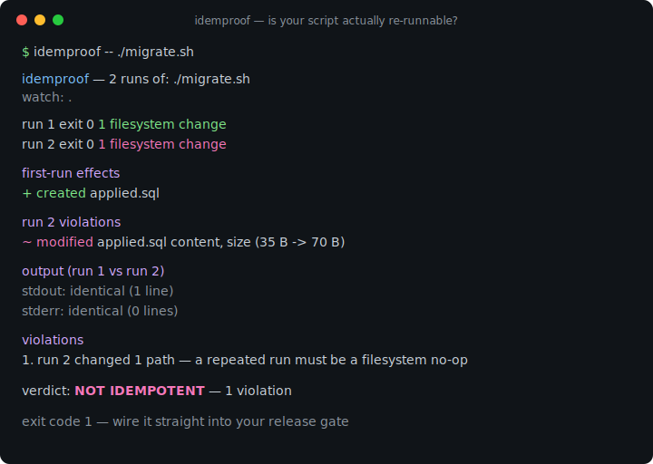
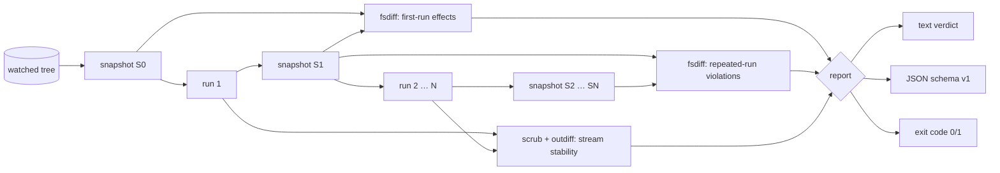

# idemproof

[English](README.md) | [中文](README.zh.md) | [日本語](README.ja.md)

[](LICENSE) [](go.mod) [](CHANGELOG.md)  [](CONTRIBUTING.md)

**idemproof：コマンドが冪等かどうかを証明するオープンソースのゼロ依存 CLI——2 回実行してファイルシステムと出力のあらゆる効果を diff し、証拠と終了コード付きの判定を返す。**



```bash
git clone https://github.com/JaydenCJ/idemproof && cd idemproof
go build -o idemproof ./cmd/idemproof    # single static binary, stdlib only
```

> プレリリース：v0.1.0 はまだどのパッケージレジストリにもタグ付けされていません。上記の通りソースからビルドしてください（Go ≥1.22 なら何でも可）。

## なぜ idemproof？

「再実行しても安全」は、運用の世界で最も繰り返され、最も検証されない主張です。セットアップスクリプト、DB マイグレーション、プロビジョニング片、Makefile ターゲット——どれもコメントで冪等性を約束しますが、その約束は誰かが 2 回実行して端末を目視で見比べることで「検証」されるのが常です。冪等性を実際に検査するツールは自分の世界しか見ません：Molecule は Ansible ロールだけ、`terraform plan` は Terraform の state だけを検証し、`./setup.sh` がこっそりログへ追記していないか、ファイルを chmod し直していないか、2 回目に違う出力を印字していないかは教えてくれません。idemproof は冪等という性質そのものを、**あらゆる**コマンドに対して検証します：監視ツリーをスナップショット（内容ハッシュ、パーミッション、シンボリックリンク先）し、コマンドを 2 回（最大 10 回）実行し、繰り返し実行がバイトレベルの no-op であること——ファイルシステム、stdout/stderr、終了コード——を要求します。失敗には証拠が付きます：正確なパス、変化した属性（`content, size (35 B -> 70 B)`）、最初に分岐した出力行。判定は終了コードなので、そのままマージ前ゲートに組み込めます。

| | idemproof | 2 回実行して目視 | Molecule 冪等性チェック | terraform plan |
|---|---|---|---|---|
| 任意のコマンドに使える | ✅ | ✅ | ❌ Ansible ロールのみ | ❌ Terraform のみ |
| 内容ハッシュ付きファイルシステム diff | ✅ | ❌ | ❌ タスク状態のみ | ❌ state のみ |
| 同サイズの内容書き換えを検出 | ✅ | ❌ | ❌ | n/a |
| 出力ドリフトを行単位で特定 | ✅ | ❌ | ❌ | ❌ |
| 揮発トークンの正規化 | ✅ | ❌ | ❌ | ❌ |
| スクリプト向け終了コードゲート | ✅ 0/1/2/3 | ❌ | ✅ | ✅ |
| オフライン・ランタイム依存ゼロ | ✅ | ✅ | ❌ Python + 依存 | ❌ |

<sub>依存数は 2026-07-13 に確認：idemproof は Go 標準ライブラリのみを import。Molecule（PyPI）はランタイムパッケージ 10 個以上に加え Ansible 本体を取得します。</sub>

## 特徴

- **設計から汎用** — 特定ツールの DSL ではなく冪等性という性質そのものを証明：シェルスクリプト、マイグレーション、`make install`、argv を持つものなら何でも。
- **バイトレベルのファイルシステム証拠** — SHA-256 内容ハッシュが同サイズの書き換えを捕捉；パーミッション、リンク先、型の変化も `old -> new` の詳細付きで一級の効果として扱う。
- **初回は無罪** — 1 回目の変更は正当な仕事として報告され、繰り返し実行での変更だけが違反になるため、実際のセットアップスクリプトは儀式なしで通る。
- **収束の証明** — `--runs 3..10` で沈静化が必要なコマンドに定常状態を与え、最後の 2 回が無変更かつ出力バイト一致であることを比較する。
- **正直な出力比較** — stdout/stderr をバイト単位で diff し最初の分岐を引用；組み込み正規化器（`timestamps`、`pids`、`durations` など）とカスタム `--scrub` 正規表現が正当なノイズを吸収し、有効な正規化器は必ずレポートに明示される。
- **終了コードが API** — 0 冪等、1 非冪等、2 用法エラー、3 実行時エラー；機械向けに安定 JSON（`schema_version: 1`）、急ぐ人間向けに `--quiet`。
- **依存ゼロ・完全オフライン** — Go 標準ライブラリのみ；idemproof が起動するプロセスは証明対象のそれだけ。テレメトリなし、ネットワークなし、永遠に。

## クイックスタート

```bash
# prove a setup one-liner is safe to re-run
idemproof --shell -- 'install -d -m 755 app/config && printf "port=8080\n" > app/config/app.conf'
```

実際にキャプチャした出力：

```text
idemproof — 2 runs of: sh -c 'install -d -m 755 app/config && printf "port=8080\n" > app/config/app.conf'
watch: .

run 1  exit 0   3 filesystem changes
run 2  exit 0   0 filesystem changes

first-run effects
  + created   app/
  + created   app/config/
  + created   app/config/app.conf

output (run 1 vs run 2)
  stdout: identical (0 lines)
  stderr: identical (0 lines)

verdict: IDEMPOTENT — converged after run 1
```

次は冪等を自称しつつ追記しているマイグレーションスクリプト（`idemproof -- ./migrate.sh`、実出力、終了コード 1）：

```text
idemproof — 2 runs of: ./migrate.sh
watch: .

run 1  exit 0   1 filesystem change
run 2  exit 0   1 filesystem change

first-run effects
  + created   applied.sql

run 2 violations
  ~ modified  applied.sql   content, size (35 B -> 70 B)

output (run 1 vs run 2)
  stdout: identical (1 line)
  stderr: identical (0 lines)

violations
  1. run 2 changed 1 path — a repeated run must be a filesystem no-op

verdict: NOT IDEMPOTENT — 1 violation
```

## CLI リファレンス

`idemproof [flags] -- <command> [args...]` —— `--` 以降はすべてコマンド自身の argv で、一切加工されない。終了コード：0 冪等、1 非冪等、2 用法エラー、3 実行時エラー。方法論の全容は [docs/method.md](docs/method.md) を参照。

| フラグ | 既定値 | 効果 |
|---|---|---|
| `--watch DIR` | `.` | 効果を監視するディレクトリ（繰り返し可） |
| `--ignore GLOB` | — | 一致パスをスキップ；`*`、`?`、`**`、裸名は任意の深さに一致（繰り返し可） |
| `--runs N` | `2` | 実行回数（2–10）；以降の実行はすべて no-op であること |
| `--format` | `text` | `text` または `json`（`schema_version: 1`） |
| `--normalize NAMES` | — | 出力比較前に揮発トークンを除去；`all` で全組み込みを有効化 |
| `--scrub REGEXP` | — | カスタムパターンを `<SCRUBBED>` に置換（繰り返し可） |
| `--no-output` | オフ | stdout/stderr の比較を完全にスキップ |
| `--allow-exit-change` | オフ | 終了コード安定要件を免除 |
| `--require-zero` | オフ | 全実行が 0 で終了すること |
| `--strict-times` | オフ | mtime のみの変化も効果とみなす |
| `--shell` | オフ | コマンドを `/bin/sh -c` 経由で実行 |
| `--dir DIR` | — | コマンドの作業ディレクトリ |
| `--env KEY=VAL` | — | コマンドへの追加環境変数（繰り返し可） |
| `--max-file-size N` | `268435456` | これより大きいファイルはサイズのみで比較 |
| `--quiet` | オフ | 判定行だけを印字 |

## 検証

このリポジトリは CI を同梱しません。上記の主張はすべてローカル実行で検証されます：

```bash
go test ./...            # 90 deterministic tests, offline, < 5 s
bash scripts/smoke.sh    # end-to-end CLI check, prints SMOKE OK
```

## アーキテクチャ



## ロードマップ

- [x] v0.1.0 — スナップショット/diff 証明ループ、収束マルチラン、出力正規化器、終了コードゲート、text/JSON レポート、90 テスト + smoke スクリプト
- [ ] 環境変数・プロセステーブル効果プローブ（ファイルシステム外のオプトインスコープ）
- [ ] `--baseline save/restore` で破壊的コマンドも無垢なツリーコピーに対して証明可能に
- [ ] 実行間で変化した小さなテキストファイルの構造化 unified diff
- [ ] 巨大な監視ツリー向けの並列ハッシュ worker プール
- [ ] テストレポート取り込み用の `--junit` 出力

全リストは [open issues](https://github.com/JaydenCJ/idemproof/issues) を参照。

## コントリビュート

issue・議論・PR を歓迎します——ローカルワークフロー（フォーマット、vet、テスト、`SMOKE OK`）は [CONTRIBUTING.md](CONTRIBUTING.md) を参照。入門タスクは [good first issue](https://github.com/JaydenCJ/idemproof/issues?q=is%3Aissue+is%3Aopen+label%3A%22good+first+issue%22) のラベル付き、設計論議は [Discussions](https://github.com/JaydenCJ/idemproof/discussions) にて。

## ライセンス

[MIT](LICENSE)
