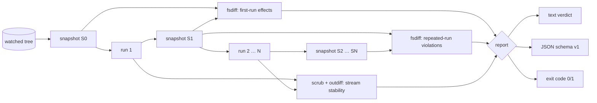

# idemproof

[English](README.md) | [中文](README.zh.md) | [日本語](README.ja.md)

[](LICENSE) [](go.mod) [](CHANGELOG.md)  [](CONTRIBUTING.md)

**idemproof：an open-source, zero-dependency CLI that proves a command is idempotent — run it twice, diff every filesystem and output effect, and get a verdict with evidence and an exit code.**


```bash
git clone https://github.com/JaydenCJ/idemproof && cd idemproof
go build -o idemproof ./cmd/idemproof    # single static binary, stdlib only
```

> Pre-release: v0.1.0 is not tagged on a package registry yet; build from source as above (any Go ≥1.22).

## Why idemproof?

"Safe to re-run" is the most repeated and least tested claim in operations. Setup scripts, DB migrations, provisioning snippets, and Makefile targets all promise idempotency in a comment — and the promise is usually verified by someone running the thing twice and squinting at the terminal. The tools that do check idempotency only check their own world: Molecule verifies Ansible roles, `terraform plan` verifies Terraform state, and neither can tell you whether `./setup.sh` quietly appends to a log, re-chmods a file, or prints something different the second time. idemproof verifies the property itself, for **any** command: it snapshots the watched tree (content hashes, modes, symlink targets), runs your command twice (or up to ten times), and demands that every repeated run be a byte-level no-op — filesystem, stdout/stderr, and exit code. Failures come with receipts: the exact path, what attribute changed (`content, size (35 B -> 70 B)`), and the first diverging output line. Verdicts are exit codes, so the proof drops straight into a pre-merge gate.

| | idemproof | run it twice + eyeball | Molecule idempotence | terraform plan |
|---|---|---|---|---|
| Works on any command | ✅ | ✅ | ❌ Ansible roles | ❌ Terraform only |
| Filesystem diff with content hashes | ✅ | ❌ | ❌ task status only | ❌ state only |
| Catches same-size content rewrites | ✅ | ❌ | ❌ | n/a |
| Output drift located to a line | ✅ | ❌ | ❌ | ❌ |
| Volatile-token normalization | ✅ | ❌ | ❌ | ❌ |
| Exit-code gate for scripting | ✅ 0/1/2/3 | ❌ | ✅ | ✅ |
| Offline, zero runtime deps | ✅ | ✅ | ❌ Python + deps | ❌ |

<sub>Dependency counts checked 2026-07-13: idemproof imports the Go standard library only; Molecule (PyPI) pulls 10+ runtime packages plus Ansible itself.</sub>

## Features

- **Generic by design** — proves the idempotency property itself, not a tool's DSL: shell scripts, migrations, `make install`, anything with an argv.
- **Byte-level filesystem evidence** — SHA-256 content hashes catch same-size rewrites; permission bits, symlink targets, and type changes are all first-class effects with `old -> new` details.
- **First run is innocent** — run 1's changes are reported as legitimate work; only repeated-run changes are violations, so real setup scripts pass without ceremony.
- **Convergence proofs** — `--runs 3..10` gives settling commands a steady state, then compares the final two runs for silence and byte-identical output.
- **Honest output comparison** — stdout/stderr diffed byte-for-byte with the first divergence quoted; built-in normalizers (`timestamps`, `pids`, `durations`, …) and custom `--scrub` regexps absorb legitimate noise, and every active normalizer is disclosed in the report.
- **Exit codes as API** — 0 idempotent, 1 not, 2 usage, 3 runtime; plus stable JSON (`schema_version: 1`) for machines and `--quiet` for humans in a hurry.
- **Zero dependencies, fully offline** — Go standard library only; the only process idemproof ever starts is the one you ask it to prove. No telemetry, no network, ever.

## Quickstart

```bash
# prove a setup one-liner is safe to re-run
idemproof --shell -- 'install -d -m 755 app/config && printf "port=8080\n" > app/config/app.conf'
```

Real captured output:

```text
idemproof — 2 runs of: sh -c 'install -d -m 755 app/config && printf "port=8080\n" > app/config/app.conf'
watch: .

run 1  exit 0   3 filesystem changes
run 2  exit 0   0 filesystem changes

first-run effects
  + created   app/
  + created   app/config/
  + created   app/config/app.conf

output (run 1 vs run 2)
  stdout: identical (0 lines)
  stderr: identical (0 lines)

verdict: IDEMPOTENT — converged after run 1
```

Now a migration script that claims idempotency but appends (`idemproof -- ./migrate.sh`, real output, exit code 1):

```text
idemproof — 2 runs of: ./migrate.sh
watch: .

run 1  exit 0   1 filesystem change
run 2  exit 0   1 filesystem change

first-run effects
  + created   applied.sql

run 2 violations
  ~ modified  applied.sql   content, size (35 B -> 70 B)

output (run 1 vs run 2)
  stdout: identical (1 line)
  stderr: identical (0 lines)

violations
  1. run 2 changed 1 path — a repeated run must be a filesystem no-op

verdict: NOT IDEMPOTENT — 1 violation
```

## CLI reference

`idemproof [flags] -- <command> [args...]` — everything after `--` is the command's own argv, untouched. Exit codes: 0 idempotent, 1 not idempotent, 2 usage error, 3 runtime error. Full methodology in [docs/method.md](docs/method.md).

| Flag | Default | Effect |
|---|---|---|
| `--watch DIR` | `.` | directory to watch for effects (repeatable) |
| `--ignore GLOB` | — | skip matching paths; `*`, `?`, `**`, bare names at any depth (repeatable) |
| `--runs N` | `2` | number of runs (2–10); later runs must all be no-ops |
| `--format` | `text` | `text` or `json` (`schema_version: 1`) |
| `--normalize NAMES` | — | scrub volatile tokens before output comparison; `all` for every built-in |
| `--scrub REGEXP` | — | custom pattern replaced with `<SCRUBBED>` (repeatable) |
| `--no-output` | off | skip stdout/stderr comparison entirely |
| `--allow-exit-change` | off | waive the stable-exit-code requirement |
| `--require-zero` | off | every run must exit 0 |
| `--strict-times` | off | treat mtime-only changes as effects |
| `--shell` | off | run the command through `/bin/sh -c` |
| `--dir DIR` | — | working directory for the command |
| `--env KEY=VAL` | — | extra environment for the command (repeatable) |
| `--max-file-size N` | `268435456` | larger files are compared by size only |
| `--quiet` | off | print only the verdict line |

## Verification

This repository ships no CI; every claim above is verified by local runs:

```bash
go test ./...            # 90 deterministic tests, offline, < 5 s
bash scripts/smoke.sh    # end-to-end CLI check, prints SMOKE OK
```

## Architecture



## Roadmap

- [x] v0.1.0 — snapshot/diff proof loop, convergence runs, output normalizers, exit-code gate, text/JSON reports, 90 tests + smoke script
- [ ] Environment-variable and process-table effect probes (opt-in scopes beyond the filesystem)
- [ ] `--baseline save/restore` so destructive commands can be proven against a pristine tree copy
- [ ] Structured unified diff for small text files that changed between runs
- [ ] Parallel hashing worker pool for very large watch trees
- [ ] `--junit` output for test-report ingestion

See the [open issues](https://github.com/JaydenCJ/idemproof/issues) for the full list.

## Contributing

Issues, discussions and pull requests are welcome — see [CONTRIBUTING.md](CONTRIBUTING.md) for the local workflow (format, vet, tests, `SMOKE OK`). Good entry points are labelled [good first issue](https://github.com/JaydenCJ/idemproof/issues?q=is%3Aissue+is%3Aopen+label%3A%22good+first+issue%22), and design questions live in [Discussions](https://github.com/JaydenCJ/idemproof/discussions).

## License

[MIT](LICENSE)
