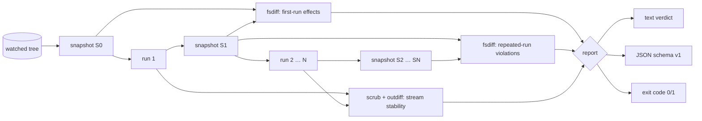

# idemproof

[English](README.md) | [中文](README.zh.md) | [日本語](README.ja.md)

[](LICENSE) [](go.mod) [](CHANGELOG.md)  [](CONTRIBUTING.md)

**idemproof：一个开源、零依赖的 CLI，用来证明一条命令是否幂等——连跑两遍，对比每一处文件系统与输出效果，给出带证据、带退出码的裁决。**


```bash
git clone https://github.com/JaydenCJ/idemproof && cd idemproof
go build -o idemproof ./cmd/idemproof    # single static binary, stdlib only
```

> 预发布：v0.1.0 尚未在任何包注册表上打 tag；请按上述方式从源码构建（任意 Go ≥1.22）。

## 为什么选 idemproof？

"可以放心重跑"是运维领域被重复最多、验证最少的承诺。安装脚本、数据库迁移、置备片段和 Makefile 目标都在注释里承诺幂等——而这个承诺通常靠某人手动跑两遍、盯着终端眯眼比对来"验证"。真正会检查幂等性的工具只管自己的一亩三分地：Molecule 只验证 Ansible role，`terraform plan` 只验证 Terraform 状态，它们都无法告诉你 `./setup.sh` 是否在悄悄追加日志、反复 chmod 某个文件、或第二次运行时打印了不同的内容。idemproof 验证的是幂等这个性质本身，适用于**任何**命令：它对被监视目录做快照（内容哈希、权限位、软链目标），把你的命令跑两遍（最多十遍），并要求每次重复运行在字节级别都是 no-op——文件系统、stdout/stderr、退出码一个都不能变。失败自带铁证：精确的路径、变化的属性（`content, size (35 B -> 70 B)`）、以及第一行分叉的输出。裁决即退出码，证明可以直接接入合并前的门禁。

| | idemproof | 手动跑两遍+肉眼 | Molecule 幂等检查 | terraform plan |
|---|---|---|---|---|
| 适用于任意命令 | ✅ | ✅ | ❌ 仅 Ansible role | ❌ 仅 Terraform |
| 带内容哈希的文件系统 diff | ✅ | ❌ | ❌ 仅任务状态 | ❌ 仅状态文件 |
| 能抓到等长内容改写 | ✅ | ❌ | ❌ | n/a |
| 输出漂移定位到行 | ✅ | ❌ | ❌ | ❌ |
| 易变 token 归一化 | ✅ | ❌ | ❌ | ❌ |
| 可脚本化的退出码门禁 | ✅ 0/1/2/3 | ❌ | ✅ | ✅ |
| 离线、零运行时依赖 | ✅ | ✅ | ❌ Python + 依赖 | ❌ |

<sub>依赖数量核查于 2026-07-13：idemproof 仅导入 Go 标准库；Molecule（PyPI）拉取 10+ 个运行时包外加 Ansible 本体。</sub>

## 特性

- **天生通用** — 证明的是幂等性质本身，而非某个工具的 DSL：shell 脚本、迁移、`make install`，任何有 argv 的东西都行。
- **字节级文件系统证据** — SHA-256 内容哈希能抓到等长改写；权限位、软链目标、类型变化都是一等公民效果，附带 `old -> new` 细节。
- **首轮无罪** — 第 1 轮的变更被记录为合法工作；只有重复运行的变更才算违规，真实的安装脚本无需额外仪式即可通过。
- **收敛证明** — `--runs 3..10` 给需要沉降的命令一个稳态，然后比较最后两轮是否静默且输出逐字节一致。
- **诚实的输出比较** — stdout/stderr 逐字节 diff 并引用第一处分叉；内置归一化器（`timestamps`、`pids`、`durations` 等）与自定义 `--scrub` 正则可吸收合理噪声，且报告始终披露所有生效的归一化器。
- **退出码即 API** — 0 幂等、1 不幂等、2 用法错误、3 运行时错误；另有稳定 JSON（`schema_version: 1`）供机器消费，`--quiet` 供赶时间的人类。
- **零依赖、完全离线** — 仅 Go 标准库；idemproof 唯一会启动的进程就是你要证明的那一个。永无遥测，永不联网。

## 快速上手

```bash
# prove a setup one-liner is safe to re-run
idemproof --shell -- 'install -d -m 755 app/config && printf "port=8080\n" > app/config/app.conf'
```

真实捕获的输出：

```text
idemproof — 2 runs of: sh -c 'install -d -m 755 app/config && printf "port=8080\n" > app/config/app.conf'
watch: .

run 1  exit 0   3 filesystem changes
run 2  exit 0   0 filesystem changes

first-run effects
  + created   app/
  + created   app/config/
  + created   app/config/app.conf

output (run 1 vs run 2)
  stdout: identical (0 lines)
  stderr: identical (0 lines)

verdict: IDEMPOTENT — converged after run 1
```

再看一个自称幂等却在追加写入的迁移脚本（`idemproof -- ./migrate.sh`，真实输出，退出码 1）：

```text
idemproof — 2 runs of: ./migrate.sh
watch: .

run 1  exit 0   1 filesystem change
run 2  exit 0   1 filesystem change

first-run effects
  + created   applied.sql

run 2 violations
  ~ modified  applied.sql   content, size (35 B -> 70 B)

output (run 1 vs run 2)
  stdout: identical (1 line)
  stderr: identical (0 lines)

violations
  1. run 2 changed 1 path — a repeated run must be a filesystem no-op

verdict: NOT IDEMPOTENT — 1 violation
```

## CLI 参考

`idemproof [flags] -- <command> [args...]` —— `--` 之后的一切都是命令自己的 argv，不做任何处理。退出码：0 幂等、1 不幂等、2 用法错误、3 运行时错误。完整方法论见 [docs/method.md](docs/method.md)。

| 标志 | 默认值 | 效果 |
|---|---|---|
| `--watch DIR` | `.` | 监视效果的目录（可重复） |
| `--ignore GLOB` | — | 跳过匹配路径；支持 `*`、`?`、`**`，裸名匹配任意深度（可重复） |
| `--runs N` | `2` | 运行次数（2–10）；后续每一轮都必须是 no-op |
| `--format` | `text` | `text` 或 `json`（`schema_version: 1`） |
| `--normalize NAMES` | — | 输出比较前擦除易变 token；`all` 启用全部内置项 |
| `--scrub REGEXP` | — | 自定义模式，匹配处替换为 `<SCRUBBED>`（可重复） |
| `--no-output` | 关 | 完全跳过 stdout/stderr 比较 |
| `--allow-exit-change` | 关 | 豁免退出码必须稳定的要求 |
| `--require-zero` | 关 | 每一轮都必须以 0 退出 |
| `--strict-times` | 关 | 将仅 mtime 的变化视为效果 |
| `--shell` | 关 | 通过 `/bin/sh -c` 运行命令 |
| `--dir DIR` | — | 命令的工作目录 |
| `--env KEY=VAL` | — | 命令的额外环境变量（可重复） |
| `--max-file-size N` | `268435456` | 超过该大小的文件仅按 size 比较 |
| `--quiet` | 关 | 只打印裁决行 |

## 验证

本仓库不附带任何 CI；以上每一条主张都由本地运行验证：

```bash
go test ./...            # 90 deterministic tests, offline, < 5 s
bash scripts/smoke.sh    # end-to-end CLI check, prints SMOKE OK
```

## 架构



## 路线图

- [x] v0.1.0 — 快照/diff 证明循环、收敛多轮运行、输出归一化器、退出码门禁、text/JSON 报告、90 个测试 + smoke 脚本
- [ ] 环境变量与进程表效果探针（文件系统之外的可选作用域）
- [ ] `--baseline save/restore`，让破坏性命令也能对着干净树副本做证明
- [ ] 对两轮之间变化的小文本文件输出结构化 unified diff
- [ ] 面向超大监视树的并行哈希 worker 池
- [ ] `--junit` 输出以供测试报告系统摄取

完整列表见 [open issues](https://github.com/JaydenCJ/idemproof/issues)。

## 参与贡献

欢迎 issue、讨论与 PR——本地工作流（格式化、vet、测试、`SMOKE OK`）见 [CONTRIBUTING.md](CONTRIBUTING.md)。入门任务标注为 [good first issue](https://github.com/JaydenCJ/idemproof/issues?q=is%3Aissue+is%3Aopen+label%3A%22good+first+issue%22)，设计讨论在 [Discussions](https://github.com/JaydenCJ/idemproof/discussions)。

## 许可证

[MIT](LICENSE)
